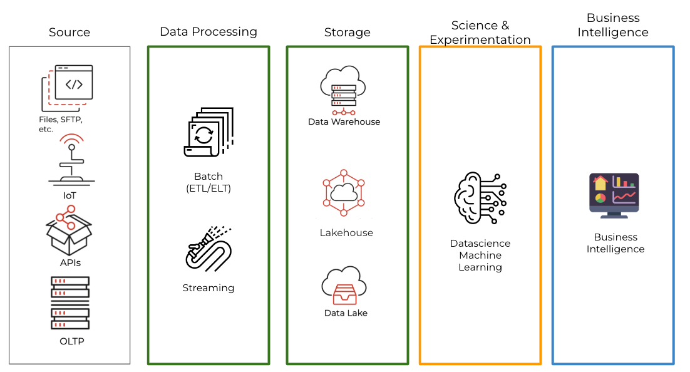
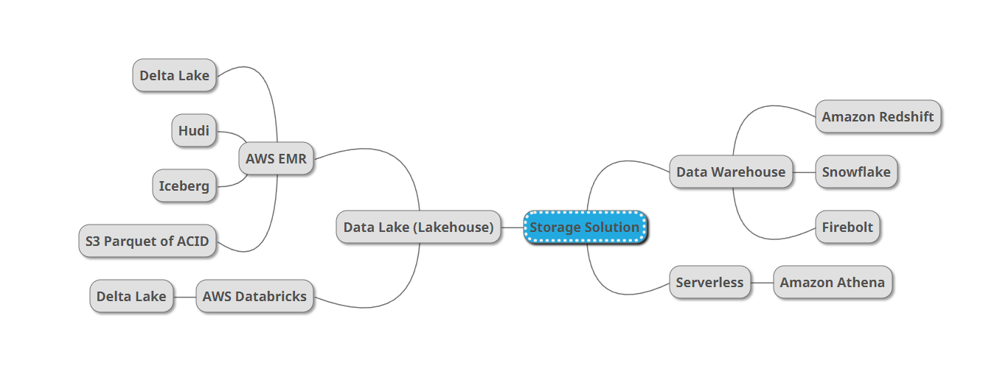
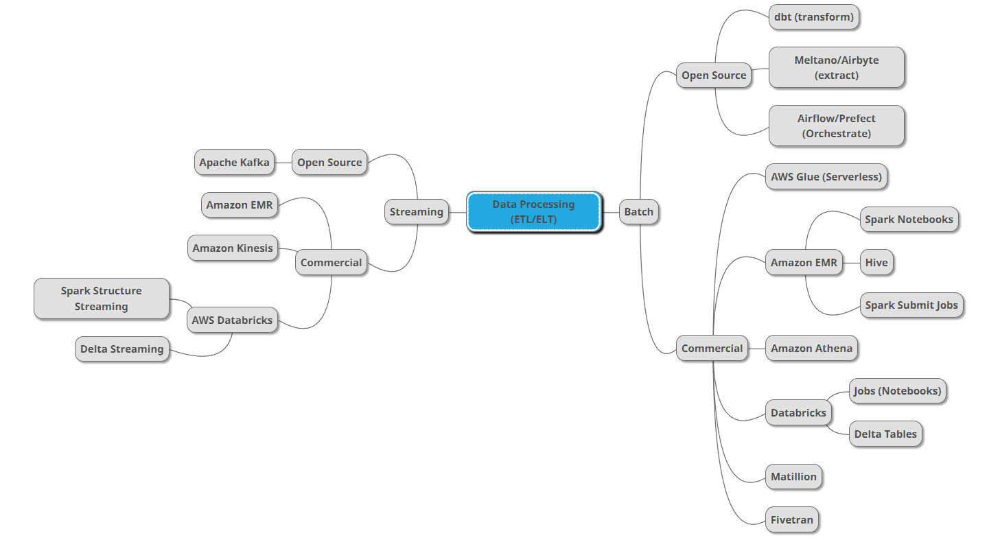
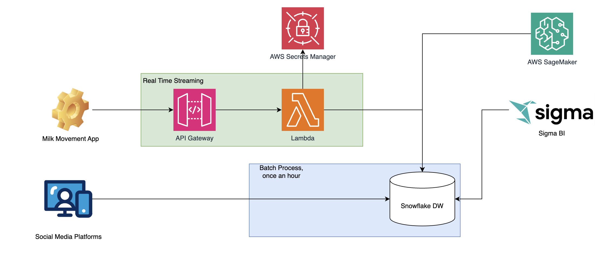

# Analytics Solution for Milk Movement

## Outline

- [Local Solution](#local-solution)
- [Production Architecture](#production-architecture)

## Overview

Every day, thousands of drivers using Milk Moovement (MM) run milk delivery routes across North America. Each driver has a cellular device running a third party piece of software to capture regular location updates. These location updates are then sent to MM and must be ingested and stored. Having regular and accurate location updates from every driver is crucial to various aspects of our business.

## The Task

​Design a service to handle ingestion and storage of location data provided by the third party service. Use the example code provided in this repository to build a simple example of how you would handle input data from a webhook. Build your solution in the `main.py` file's `handle_webhook` function.

As an additional exercise, include design for how you would handle this kind of task in production. This service should be built using AWS tools/services. A simple writeup will suffice for this part of the assignment. Bonus points for diagrams/illustrations.

## Key requirements

- Third party sends location updates one at a time via webhook. Example payload:

```json
{
  "event": {
    "createdAt": "2023-07-24T19:52:07.507Z",
    "type": "user.updated_trip",
    "location": {
      "type": "Point",
      "coordinates": [
        -119.3056079094478,
        36.00942850116281
      ]
    },
    "user": {
      "_id": "6477c8c614fe6c005a89df2b",
      "updatedAt": "2023-07-24T19:52:07.507Z",
      "MMUserId": "619481dd940bbe643baf776e",
      "trip": {
        "_id": "64bebf33fc633e0061e84882",
        "createdAt": "2023-07-24T18:13:07.159Z",
        "updatedAt": "2023-07-24T18:13:07.159Z",
        "externalId": "1f76eed0-992a-4d17-b532-462f089a42e8",
        "MMUserId": "619481dd940bbe643baf776e",
        "startedAt": "2023-07-24T18:13:07.159Z",
        "metadata": {
          "route_session_type": "RawMilk",
          "route_session_id": "64bebf32d38530406ca4f254"
        }
      }
    }
  }
}

```

- The location updates should be normalized before stored / shared
- Ideal location destination is stored in an optimized format in an S3 based data lake or directly in our Snowflake warehouse
- Include an example of how to send events to an event bus (Kinesis for example) when particular webhook event type is received (for example, type == user.entered_geofence or user.exited_geofence)

## Local Solution

For local solution I am using DuckDB to store the data.

DuckDB is a fast in-memory database that is well suited for this kind of use case. Alternativly I could used PyArrow and store data files in Object Storage.

The data is processed by a Flask application that listens for webhook events from the Milk Movement API. Currenlty, we are using sample data from the Milk Movement API.

Each event is flattened and stored in DuckDB table.

Table name: `webhook_data` and the schema is the following:

```sql
CREATE TABLE webhook_data (
    id TEXT,
    created_at TIMESTAMP,
    live BOOLEAN,
    event_type TEXT,
    user_id TEXT,
    MMUserId TEXT,
    latitude DOUBLE,
    longitude DOUBLE,
    trip_id TEXT,
    trip_external_id TEXT,
    trip_created_at TIMESTAMP,
    trip_updated_at TIMESTAMP,
    trip_started_at TIMESTAMP,
    trip_MMUserId TEXT,
    route_session_type TEXT,
    process_timestamp TIMESTAMP,
    process_hour TIMESTAMP
)
```

I've added a `process_hour` column to the table to store the hour of the day when the event was processed. This is useful for partitioning the data and ingesting data into the cloud data warehouse.

Solution has been tested locally using DuckDB. While the data is being processed, the Flask application is logging the data to the console and to the `webhook_service.log` file.

### Run the solution

```bash
git clone https://github.com/dimoobraznii1986/milk-movement.git
cd milk-movement
poetry install
poetry run bash run_test.sh
```

It will start the Flask application and the webhook service will be listening for events from the Milk Movement API.

Data will be stored in the DuckDB database`webhook_data.duckdb` file.

Below are the queries that can be used to query the data in DuckDB.


### Query the data in DuckDb

0. Total number of events

    ```sql
    duckdb webhook_data.duckdb -c "SELECT  count(*) as events FROM milk_events;"
    ┌────────┐
    │ events │
    │ int64  │
    ├────────┤
    │     92 │
    └────────┘
    ```

1. Hourly Event Analysis

    ```sql
    duckdb webhook_data.duckdb -c "
    SELECT
        DATE_TRUNC('hour', created_at) as event_hour,
        COUNT(*) as event_count,
        event_type
    FROM milk_events
    GROUP BY DATE_TRUNC('hour', created_at), event_type
    ORDER BY event_hour DESC;
    "
    ┌─────────────────────┬─────────────┬───────────────────┐
    │     event_hour      │ event_count │    event_type     │
    │      timestamp      │    int64    │      varchar      │
    ├─────────────────────┼─────────────┼───────────────────┤
    │ 2023-08-08 18:00:00 │          73 │ user.updated_trip │
    │ 2023-08-08 17:00:00 │          18 │ user.updated_trip │
    │ 2023-08-08 17:00:00 │           1 │ user.started_trip │
    └─────────────────────┴─────────────┴───────────────────┘
    ```

2. Daily and Hourly Activity Patterns

    ```sql
    duckdb webhook_data.duckdb -c "
    SELECT
        EXTRACT(HOUR FROM created_at) as hour_of_day,
        COUNT(*) as total_events,
        COUNT(DISTINCT user_id) as unique_users,
        COUNT(DISTINCT trip_id) as unique_trips
    FROM milk_events
    GROUP BY EXTRACT(HOUR FROM created_at)
    ORDER BY hour_of_day;
    "
    ┌─────────────┬──────────────┬──────────────┬──────────────┐
    │ hour_of_day │ total_events │ unique_users │ unique_trips │
    │    int64    │    int64     │    int64     │    int64     │
    ├─────────────┼──────────────┼──────────────┼──────────────┤
    │          17 │           19 │            1 │            1 │
    │          18 │           73 │            1 │            1 │
    └─────────────┴──────────────┴──────────────┴──────────────┘
    ```

3. Busiest Hours by Event Type

    ```sql
    duckdb webhook_data.duckdb -c "
    SELECT
        EXTRACT(HOUR FROM created_at) as hour_of_day,
        event_type,
        COUNT(*) as event_count
    FROM milk_events
    GROUP BY EXTRACT(HOUR FROM created_at), event_type
    ORDER BY hour_of_day, event_count DESC;
    "
    ┌─────────────┬───────────────────┬─────────────┐
    │ hour_of_day │    event_type     │ event_count │
    │    int64    │      varchar      │    int64    │
    ├─────────────┼───────────────────┼─────────────┤
    │          17 │ user.updated_trip │          18 │
    │          17 │ user.started_trip │           1 │
    │          18 │ user.updated_trip │          73 │
    └─────────────┴───────────────────┴─────────────┘
    ```

4. Daily Trip Summary

    ```sql
    duckdb webhook_data.duckdb -c "
    SELECT
        DATE_TRUNC('day', created_at) as day,
        EXTRACT(HOUR FROM created_at) as hour_of_day,
        COUNT(DISTINCT trip_id) as unique_trips,
        COUNT(*) as total_events
    FROM milk_events
    GROUP BY
        DATE_TRUNC('day', created_at),
        EXTRACT(HOUR FROM created_at)
    ORDER BY day DESC, hour_of_day;
    "
    ┌────────────┬─────────────┬──────────────┬──────────────┐
    │    day     │ hour_of_day │ unique_trips │ total_events │
    │    date    │    int64    │    int64     │    int64     │
    ├────────────┼─────────────┼──────────────┼──────────────┤
    │ 2023-08-08 │          17 │            1 │           19 │
    │ 2023-08-08 │          18 │            1 │           73 │
    └────────────┴─────────────┴──────────────┴──────────────┘
    ```

5. Peak Hours Analysis

    ```sql
    duckdb webhook_data.duckdb -c "
    WITH hourly_events AS (
        SELECT
            EXTRACT(HOUR FROM created_at) as hour_of_day,
            COUNT(*) as event_count
        FROM milk_events
        GROUP BY EXTRACT(HOUR FROM created_at)
    )
    SELECT
        hour_of_day,
        event_count,
        ROUND(event_count * 100.0 / SUM(event_count) OVER (), 2) as percentage_of_total
    FROM hourly_events
    ORDER BY event_count DESC;
    "
    ┌─────────────┬─────────────┬─────────────────────┐
    │ hour_of_day │ event_count │ percentage_of_total │
    │    int64    │    int64    │       double        │
    ├─────────────┼─────────────┼─────────────────────┤
    │          18 │          73 │               79.35 │
    │          17 │          19 │               20.65 │
    └─────────────┴─────────────┴─────────────────────┘
    ```

6. User Activity Summary

    ```sql
    duckdb webhook_data.duckdb -c "
    SELECT
        user_id,
        COUNT(DISTINCT EXTRACT(HOUR FROM created_at)) as active_hours,
        COUNT(*) as total_events,
        MIN(created_at) as first_seen,
        MAX(created_at) as last_seen
    FROM milk_events
    GROUP BY user_id
    ORDER BY active_hours DESC;
    "
    ┌──────────────────────────┬──────────────┬──────────────┬─────────────────────────┬───────────────────────┐
    │         user_id          │ active_hours │ total_events │       first_seen        │       last_seen       │
    │         varchar          │    int64     │    int64     │        timestamp        │       timestamp       │
    ├──────────────────────────┼──────────────┼──────────────┼─────────────────────────┼───────────────────────┤
    │ 646e94a5be2c8d00504f9928 │            2 │           92 │ 2023-08-08 17:50:48.793 │ 2023-08-08 18:38:23.4 │
    └──────────────────────────┴──────────────┴──────────────┴─────────────────────────┴───────────────────────┘
    ```

7. Geographic Activity by Hour

    ```sql
    duckdb webhook_data.duckdb -c "
    SELECT
        EXTRACT(HOUR FROM created_at) as hour_of_day,
        ROUND(AVG(latitude), 4) as avg_latitude,
        ROUND(AVG(longitude), 4) as avg_longitude,
        COUNT(*) as event_count
    FROM milk_events
    WHERE latitude IS NOT NULL AND longitude IS NOT NULL
    GROUP BY EXTRACT(HOUR FROM created_at)
    ORDER BY hour_of_day;
    "
    ┌─────────────┬──────────────┬───────────────┬─────────────┐
    │ hour_of_day │ avg_latitude │ avg_longitude │ event_count │
    │    int64    │    double    │    double     │    int64    │
    ├─────────────┼──────────────┼───────────────┼─────────────┤
    │          17 │      36.9567 │     -120.2873 │          18 │
    │          18 │      36.9529 │     -120.2822 │          73 │
    └─────────────┴──────────────┴───────────────┴─────────────┘
    ```

8. Live Events Analysis

    ```sql
    duckdb webhook_data.duckdb -c "
    SELECT
        EXTRACT(HOUR FROM created_at) as hour_of_day,
        live,
        COUNT(*) as event_count,
        COUNT(DISTINCT trip_id) as unique_trips
    FROM milk_events
    GROUP BY EXTRACT(HOUR FROM created_at), live
    ORDER BY hour_of_day, live;
    "
    ┌─────────────┬─────────┬─────────────┬──────────────┐
    │ hour_of_day │  live   │ event_count │ unique_trips │
    │    int64    │ boolean │    int64    │    int64     │
    ├─────────────┼─────────┼─────────────┼──────────────┤
    │          17 │ true    │          19 │            1 │
    │          18 │ true    │          73 │            1 │
    └─────────────┴─────────┴─────────────┴──────────────┘
    ```

9. Daily Geofence Activity Analysis

    ```sql
    duckdb webhook_data.duckdb -c "
    WITH location_changes AS (
        SELECT
            DATE_TRUNC('day', created_at) as day,
            trip_id,
            latitude,
            longitude,
            LAG(latitude) OVER (PARTITION BY trip_id ORDER BY created_at) as prev_lat,
            LAG(longitude) OVER (PARTITION BY trip_id ORDER BY created_at) as prev_long,
            -- Calculate distance from previous point (simplified)
            CASE
                WHEN LAG(latitude) OVER (PARTITION BY trip_id ORDER BY created_at) IS NOT NULL
                THEN SQRT(
                    POWER(69.1 * (latitude - LAG(latitude) OVER (PARTITION BY trip_id ORDER BY created_at)), 2) +
                    POWER(69.1 * (longitude - LAG(longitude) OVER (PARTITION BY trip_id ORDER BY created_at)) * COS(latitude / 57.3), 2)
                )
                ELSE 0
            END as distance_miles
        FROM milk_events
        WHERE latitude IS NOT NULL
        AND longitude IS NOT NULL
    )
    SELECT
        day,
        COUNT(*) as total_location_updates,
        COUNT(CASE WHEN distance_miles > 0.1 THEN 1 END) as potential_geofence_crosses,
        COUNT(DISTINCT trip_id) as unique_trips,
        ROUND(AVG(distance_miles), 2) as avg_distance_miles,
        ROUND(SUM(distance_miles), 2) as total_distance_miles
    FROM location_changes
    GROUP BY day
    ORDER BY day DESC;
    "
    ```

> The distance calculation is based on the Haversine formula, which is a more accurate way to calculate the distance between two points on the Earth's surface.
>    ```sql
>    SQRT(
>        POWER(69.1 * (latitude - prev_latitude), 2) +
>        POWER(69.1 * (longitude - prev_longitude) * COS(latitude / 57.2958), 2)
>    )
>    ```
>   Where:
>    - `69.1` is the approximate number of miles per degree of latitude
>    - `COS(latitude / 57.2958)` accounts for the fact that longitude degrees vary in distance based on latitude
>    - `57.2958` is the conversion factor from degrees to radians (180/π)
>Components:
>   1. `latitude - prev_latitude`: Change in latitude
>   2. `longitude - prev_longitude`: Change in longitude
>   3. `COS(latitude / 57.2958)`: Correction factor for longitude at given latitude
>   4. `POWER(..., 2)`: Square the differences (Pythagorean theorem)
>   5. `SQRT(...)`: Take the square root to get the final distance

This gives an approximate distance in miles between two points on Earth.


## Production Architecture

[Back to top](#table-of-contents)

Production implementation of analytics solution is different from local implementation. Based on [AWS Well-Architected Framework](https://aws.amazon.com/architecture/well-architected/), we can define the following components:

- Operational Excellence
- Security
- Reliability
- Performance Efficiency
- Cost Optimization

To achieve these capabilities we can use proven solutions and best practices. Since we are using AWS, we can use AWS services to achieve these capabilities.



Based on requirements for our analytics solution, we can define the following user cases:

- real-time ingestion of events from Milk Movement API
- integration with 3rd party services to support Marketing, Sales, Customer Success, and Engineering teams
- hourly batch processing of events
- storage of events in a data lake or data warehouse
- visualization of events in a data warehouse using BI tools
- integration with AI and ML services to support analytics and reporting
- software engineering and DevOps best practices

### Storage

There are many options for storage systems available in AWS.



Each system has its own pros and cons. In our case, we need solutions that will scalabale, secure, and cost effective. Moreover, we have to consider the size of the team and the complexity of the system.

Snowflake allows us to start small and scale big. It is a cloud data warehouse that is designed to handle large datasets and complex queries. It is also a good fit for our use case because it is a data warehouse that is optimized for analytics.

Inside snowflake we will model several layers:

1. Raw layer - where we will store the raw data from Milk Movement API and 3rd party services.
2. Staging layer - where we will transform the events data.
3. Analytics layer - where we will store the data for analytics and reporting using Dimensions and Facts.

In the next sections we will discuss how to ingest data into snowflake and how to transform data it.

### Data Processing

For data processing we have to consider the following options:



There are two primary use cases:

1. Real-time ingestion of events from Milk Movement API - we can use AWS Gateway API and AWS Lambda to process events from Milk Movement API.
2. Integration with 3rd party services to support Marketing, Sales, Customer Success, and Engineering teams - we can use Fivetran or open source connectors alternatives like Airbyte and Meltano.
3. Hourly batch processing of events - we can use dbt framework to process events and other data sources.

### Data Visualization

For Data Visualization we can go with open source tools like Metabase or use commercial tools like Looker, Tableau or Sigma.

### AI and Machine Learning

For AI and Machine Learning we can use AWS SageMaker or Snowflkae ML capabilities.

### Engineering Excellence

For Engineering Excellence we should follow software engineering and DevOps best practices:

- Continious Integration and Continious Deployment
- Infrastructure as Code - we can use Terraform to create and manage infrastructure
- Monitoring and Observability - we can use AWS Cloudwatch or open source tools like Prometheus and Grafana.
- Security - we can use AWS Identity and Access Management (IAM) to manage access to resources and AWS Secrets Manager to manage secrets
- Cost Optimization - we can use AWS Cost Explorer, AWS Budgets, and AWS Cost Allocation Tags to manage costs


The target architecture that will cover all the requirements is the following:



We are supporting real-time ingesting into staging layer and hourly batch processing at the same time.
